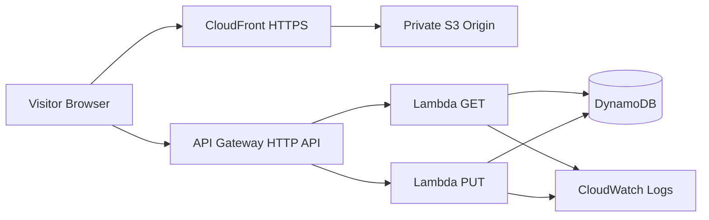
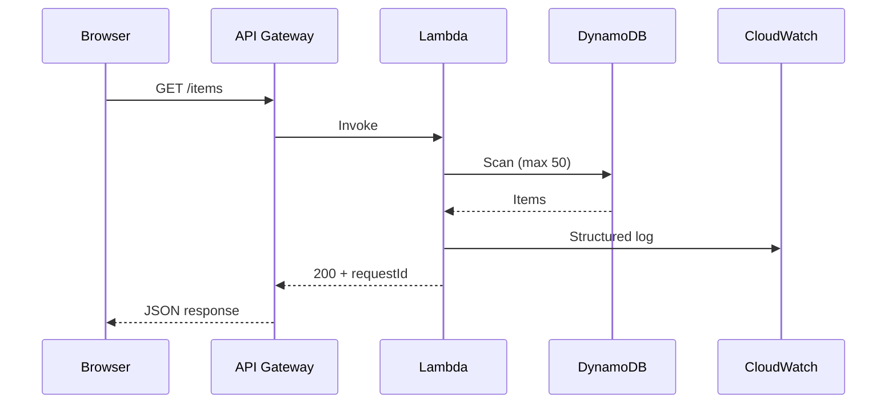

# ☁️ CloudCraft by Ibad

[](https://github.com/Ibad84671/cloudcraft-by-ibad-serverless-showcase/actions/workflows/ci.yml)
[](https://aws.amazon.com/)
[](https://aws.amazon.com/cloudformation/)
[](LICENSE.txt)

> **An interactive AWS serverless architecture showcase, request tracer, and deployable reference stack.**

CloudCraft keeps the original showcase idea but turns it into a serious engineering demo: explore the architecture visually, trace a request through the serverless path, inspect simulated observability output, or connect the UI to a deployed API.

## ✨ What it demonstrates

- Futuristic, responsive architecture command view
- Clearly labelled **Simulation** mode versus **Live AWS** API mode
- Animated request tracing across CloudFront → API Gateway → Lambda → DynamoDB
- Developer-oriented request ID, status, latency, and log views
- Real API Gateway HTTP API routes: `GET /items` and `PUT /items`
- Lambda validation, structured errors, DynamoDB persistence, and CloudWatch logs
- Private encrypted S3 origin behind CloudFront Origin Access Identity
- AWS CloudFormation as the infrastructure source of truth
- One-command Bash deployment plus a Windows PowerShell deployment helper
- CloudFormation linting, JavaScript syntax checks, and Checkov security scanning in CI
- Reduced-motion support and keyboard shortcuts (`R`, `A`, `L`, `?`)

## 🏗️ Architecture



### Request flow



The architecture view in the UI is intentionally a **simulation** unless a real API endpoint is configured. It never pretends that an animated trace is an AWS execution.

## 📁 Repository

```text
.
├── .github/workflows/ci.yml
├── docs/
│   ├── architecture.md
│   ├── deployment.md
│   ├── security.md
│   └── development.md
├── infrastructure/cloudformation/template.yaml
├── scripts/
│   ├── deploy.sh
│   ├── deploy.ps1
│   ├── validate.sh
│   ├── cleanup.sh
│   └── destroy.ps1
├── src/
│   ├── index.html
│   └── lambda/
│       ├── get-items.js
│       └── put-items.js
├── CHANGELOG.md
├── CONTRIBUTING.md
├── SECURITY.md
└── README.md
```

## 🚀 Deploy

### Prerequisites

- AWS CLI v2
- An authenticated AWS identity with permission to create the resources in the CloudFormation template
- Bash (Linux/macOS/WSL) **or** PowerShell on Windows

Validate first:

```bash
./scripts/validate.sh
```

Deploy everything:

```bash
./scripts/deploy.sh
```

Windows:

```powershell
.\scripts\deploy.ps1
```

The deployment creates the infrastructure, uploads `src/` to the private S3 origin, invalidates CloudFront, and prints the frontend and API URLs.

### Manual CloudFormation deployment

```bash
aws cloudformation deploy \
  --template-file infrastructure/cloudformation/template.yaml \
  --stack-name cloudcraft-demo \
  --parameter-overrides EnvironmentName=demo \
  --capabilities CAPABILITY_IAM CAPABILITY_NAMED_IAM
```

After a manual stack deployment, upload the frontend to the `WebsiteBucketName` output and invalidate the distribution.

## 🔌 Live API mode

After deployment, copy the `ApiUrl` CloudFormation output into the **Live API URL** field in the web application. The UI will then call `GET /items` during a trace and label the trace **Live AWS**.

The UI does not contain AWS credentials. CORS is parameterized by `AllowedOrigin`; for production, set it to the exact CloudFront origin instead of `*`.

## 🔐 Security

- S3 public access is blocked; CloudFront is the only intended origin reader.
- S3 uses server-side encryption.
- DynamoDB uses server-side encryption and point-in-time recovery.
- Lambda IAM permissions are scoped to the application table and its log streams.
- API input is validated and sensitive error details are not returned to clients.
- No credentials or secrets are stored in frontend source.
- CI uses read-only repository permissions and scans CloudFormation with Checkov.

See [`SECURITY.md`](SECURITY.md) and [`docs/security.md`](docs/security.md).

## 💰 Cost considerations

This stack uses pay-per-request DynamoDB, Lambda, API Gateway HTTP API, S3, and CloudFront. Actual cost depends on traffic, storage, logs, and AWS region. Free-tier eligibility changes over time, so treat this as a low-cost demo architecture rather than a guaranteed-free deployment.

Delete demo infrastructure when finished:

```bash
./scripts/cleanup.sh
```

or on Windows:

```powershell
.\scripts\destroy.ps1
```

## 🧪 Validation

CI runs:

1. CloudFormation linting
2. Node.js syntax validation for both Lambda handlers
3. Frontend smoke checks
4. Checkov CloudFormation security scanning

There are no fake tests whose only purpose is to make CI green.

## 🛠️ Development

The frontend is intentionally dependency-light: semantic HTML, CSS design tokens, and vanilla JavaScript. Open `src/index.html` locally to explore the simulator without AWS. For the live path, deploy the CloudFormation stack and configure its API endpoint in the UI.

More detail:

- [`docs/architecture.md`](docs/architecture.md)
- [`docs/deployment.md`](docs/deployment.md)
- [`docs/security.md`](docs/security.md)
- [`docs/development.md`](docs/development.md)

## 🗺️ Roadmap

- Optional authenticated live mode with Cognito when there is a real product requirement
- Deeper CloudWatch dashboards and alarms for a deployed environment
- Automated browser tests for the interactive frontend
- Optional CI/CD deployment using GitHub OIDC rather than long-lived AWS keys

## License

MIT © Ibad Shaikh
