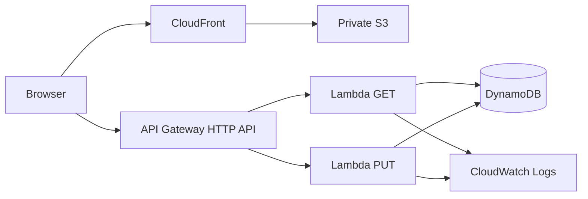

# CloudCraft Architecture

CloudCraft is a static frontend plus a small serverless API. The browser can operate entirely in simulation mode; a deployed stack adds live API operations.

## Production path



## Responsibilities

| Service | Responsibility |
|---|---|
| S3 | Private storage for the static frontend |
| CloudFront | HTTPS edge delivery and caching |
| API Gateway | Public HTTP API boundary |
| Lambda | Stateless request processing and validation |
| DynamoDB | Serverless persistence for showcase items |
| CloudWatch Logs | Lambda execution logs |
| CloudFormation | Complete infrastructure source of truth |

## Request contract

`GET /items` returns up to 50 persisted items.

`PUT /items` accepts JSON:

```json
{"name":"Architecture demo","description":"Serverless showcase"}
```

The Lambda validates a non-empty name up to 100 characters and a description up to 500 characters. Each write uses the Lambda request ID as the item ID.

## Simulation versus live

The visual trace is not an AWS telemetry product. It is a deterministic UI simulation designed to explain architecture. When the user supplies a real API endpoint, the UI performs a real `GET /items` request and labels the trace `Live AWS`.
